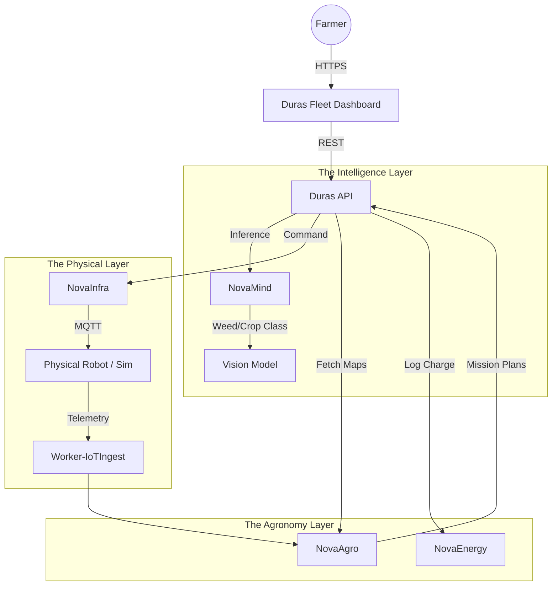

# 🚜 DurasAGV

> **The Autonomous Custodian of Regenerative Soil.**
> A lightweight, electric, and AI-driven robot platform for precision non-chemical farming.

[](https://www.google.com/search?q=https://github.com/novaeco-tech/product-duras-agv/actions)
[](https://opensource.org/licenses/MIT)
[](https://www.google.com/search?q=https://duras-agv.novaeco.tech)

**DurasAGV** is the flagship hardware-software product of the NovaEco. It solves the paradox of modern agriculture: "How do we increase yield while restoring soil health?"

Unlike heavy tractors that compact soil and rely on chemical sprays, Duras is a swarm-ready, lightweight AGV (Automated Guided Vehicle) that uses computer vision to mechanically weed, micro-dose nutrients, and monitor biodiversity.

-----

## 🎯 Value Proposition

Regenerative agriculture requires **precision** at a scale humans cannot deliver manually. DurasAGV automates this stewardship:

1.  **Zero Soil Compaction:** Designed to be ultra-lightweight to preserve soil aeration and microbiome health.
2.  **Chemical-Free Weeding:** Uses `NovaMind` computer vision to distinguish crops from weeds, removing them mechanically or via laser (no glyphosate).
3.  **Real-Time Stewardship:** Every pass over the field is a data-collection mission, updating `NovaAgro` with precise humidity, NPK, and growth metrics.

-----

## 🏗️ Architecture (The Robot Brain)

This repository hosts the **Mission Control Software** and the **Fleet Orchestrator**. It does not contain the low-level firmware (which runs on the hardware), but rather the high-level logic that connects the physical fleet to the NovaEco cloud.



### Integrated Services

  * **[NovaAgro](https://www.google.com/search?q=https://agriculture.novaeco.tech):** The "Map Provider." Defines the field boundaries, crop rows, and daily objectives (e.g., "Weed Sector 7").
  * **[NovaMind](https://www.google.com/search?q=https://mind.novaeco.tech):** The "Eyes." The robot streams camera frames here to identify pests, diseases, or weeds in real-time.
  * **[NovaInfra](https://www.google.com/search?q=https://infrastructure.novaeco.tech):** The "Fleet Manager." Handles device registration, OTA updates, and secure command-and-control (MQTT).
  * **[NovaEnergy](https://www.google.com/search?q=https://energy.novaeco.tech):** Manages battery health and coordinates V2G (Vehicle-to-Grid) charging when the fleet is idle.

-----

## ✨ Key Features

### 1\. The "Weed, Don't Spray" Engine

Instead of blanketing a field in herbicide, Duras performs **surgical weeding**.

  * **Process:** Camera Stream -\> `NovaMind` Inference -\> "Weed Detected at {x,y}" -\> Mechanical Arm actuation.
  * **Impact:** 90% reduction in chemical costs; 100% preservation of soil biology.

### 2\. Swarm Coordination

One robot is slow; a swarm is fast. The Duras API allows a single operator to manage 20+ units.

  * **Grid Logic:** The field is divided into dynamic sectors. As robots finish a sector, `NovaInfra` re-tasks them to the next available zone.
  * **Return-to-Base:** Automated charging orchestration prevents "dead robots in the field" by predicting battery range vs. task load.

### 3\. The "Soil Whisperer" Mode

While moving, Duras drags non-invasive sensors to build a centimeter-accurate soil map.

  * **Data Collected:** Moisture, pH, Temperature, Electrical Conductivity.
  * **Visualization:** Data is overlaid on the `NovaAgro` farm map, allowing farmers to spot drought stress days before it is visible to the naked eye.

-----

## 🚀 Getting Started

We use **DevContainers** to simulate the robot environment without needing physical hardware.

### Prerequisites

  * Docker Desktop
  * VS Code (with Remote Containers extension)

### Installation

1.  **Clone the repo:**
    ```bash
    git clone https://github.com/novaeco-tech/product-duras-agv.git
    cd product-duras-agv
    ```
2.  **Open in VS Code:**
      * Run `code .`
      * Click **"Reopen in Container"** when prompted.
3.  **Start the Mission Control:**
    ```bash
    make dev
    ```
      * **Fleet Dashboard:** http://localhost:3000
      * **Orchestrator API:** http://localhost:8000/docs
      * **Simulated Telemetry:** http://localhost:8000/simulator (Sends fake MQTT data)

-----

## 📂 Repository Structure

```text
product-duras-agv/
├── api/                # Python/FastAPI (The Orchestrator)
│   ├── src/
│   │   ├── missions/   # Logic for "Go to X, Perform Y"
│   │   ├── swarm/      # Coordination logic for multiple units
│   │   └── clients/    # gRPC clients for NovaMind/NovaAgro
├── app/                # React/Leaflet Frontend (The Dashboard)
│   ├── src/
│   │   ├── map/        # GIS components for field visualization
│   │   └── telemetry/  # Real-time battery/speed gauges
├── simulator/          # Python Script
│   └── main.py         # Mocks a physical robot sending MQTT data
├── website/            # Product Documentation (Docusaurus)
└── tests/              # Integration tests
```

-----

## 🧪 Testing

  * **Simulator Testing:** `make test-sim`
      * spins up the `simulator` container and asserts that the API correctly receives and processes telemetry.
  * **Mission Logic:** `make test-mission`
      * Tests the path-planning algorithms and battery-safe return logic.

-----

## 🤝 Contributing

We are actively looking for contributors with experience in **ROS2** (Robot Operating System), **Computer Vision**, and **GIS**.
See [CONTRIBUTING.md](https://www.google.com/search?q=../.github/CONTRIBUTING.md) for details.

**Maintainers:** `@novaeco-tech/maintainers-product-duras-agv`